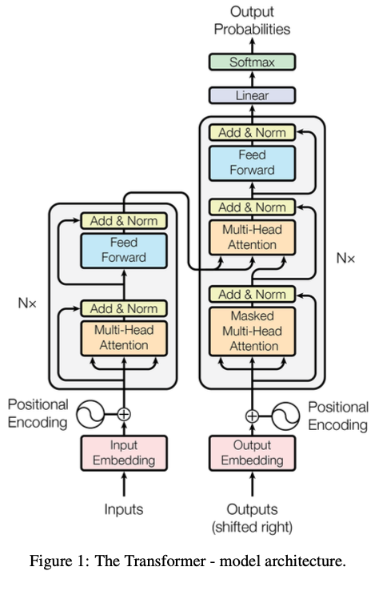

# Transformer PyTorch

This repository contains a PyTorch implementation of the Transformer architecture in the paper [Attention is All You Need](https://arxiv.org/abs/1706.03762). 

This serves as an accompanying codebase for the blog post [here](https://blog.chudioranu.com/posts/language-models).

The implemented model is trained on a Machine Translation task on Igbo-English sentence pairs.